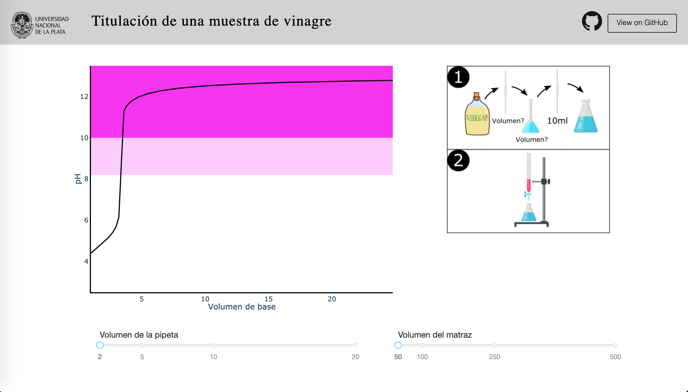

# Titulacion Acido-Base

## Acerca de la app

Esta app calcula la curva de titulacion teorica de una titulacion de
una muestra de vinagre con un acido monoprotico fuerte.

### Seleccion del material

La curva se calcula estimando un 5% p/v de acido acetico en el vinagre,
una alicuota de 10ml y una dilucion realizada con los volumenes seleccionados.
El grafico muestra en regiones coloreadas los diferentes colores que
desarrolla la fenolftaleina en respuesta al pH.

## How to run this app

(The following instructions apply to Posix/bash. Windows users should check
[here](https://docs.python.org/3/library/venv.html).)

First, clone this repository and open a terminal inside the root folder.

Create and activate a new virtual environment (recommended) by running
the following:

```bash

python3 -m venv myvenv

source myvenv/bin/activate

```

Install the requirements:

```bash
pip install -r requirements.txt
```
Run the app:

```bash
python app.py
```
Open a browser at http://127.0.0.1:8050

## Screenshots


 
